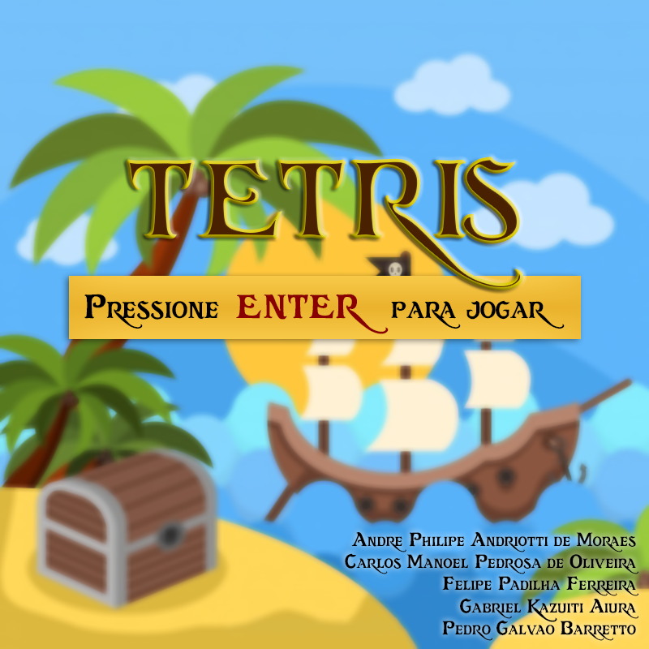

# Tetris temático Pirata!

Para jogar utilize as teclas das setas no teclado.

 - Esquerda e direita para movimentar as peças.
 - Seta para cima para rotacionar a peça.
 - Tecla para baixo para tecla descer mais rápido.
 
Se divirta!
